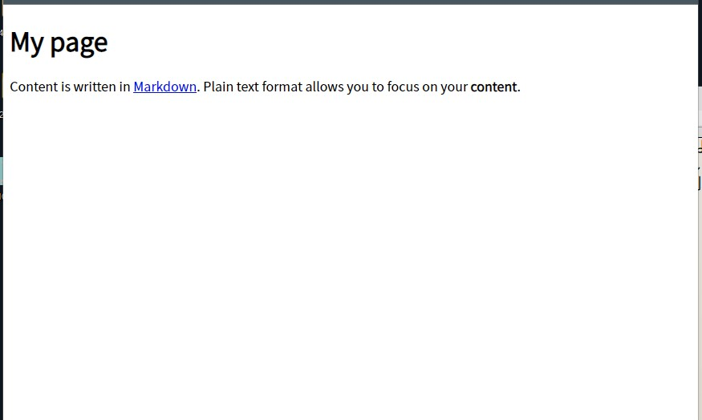
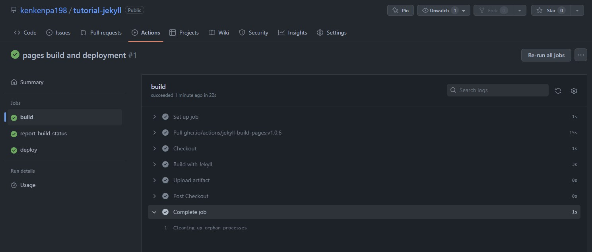
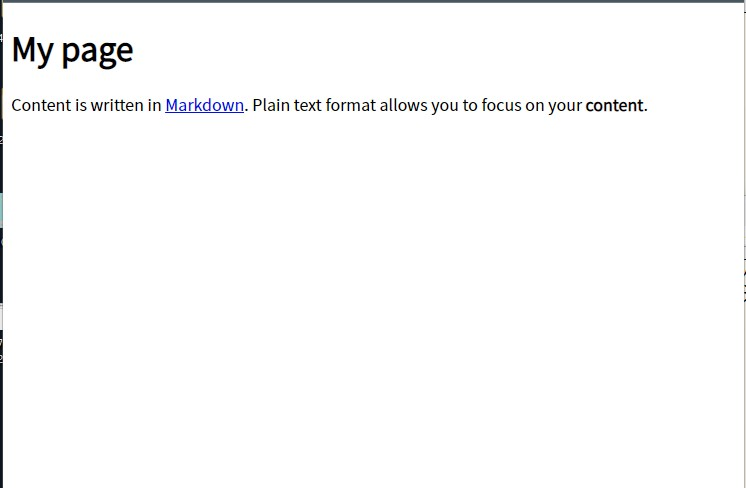
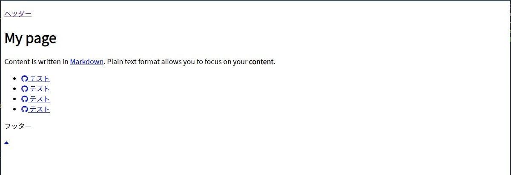
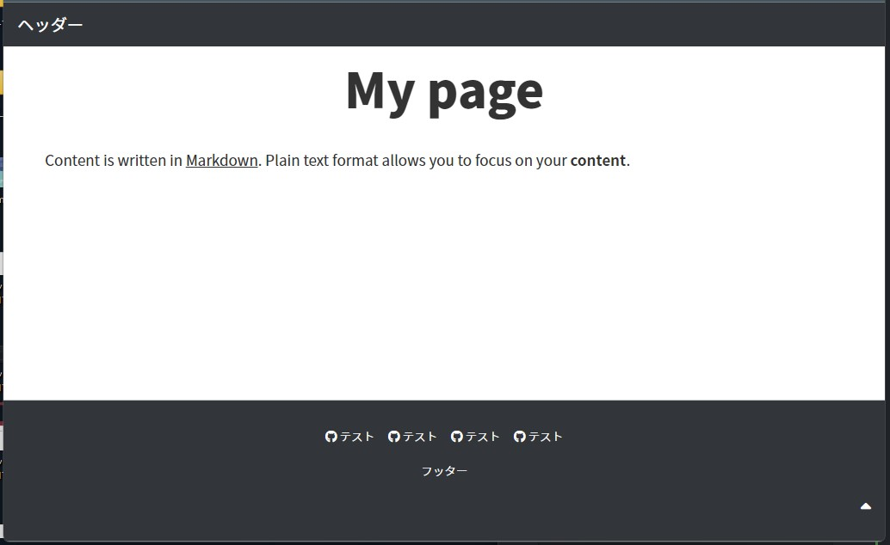
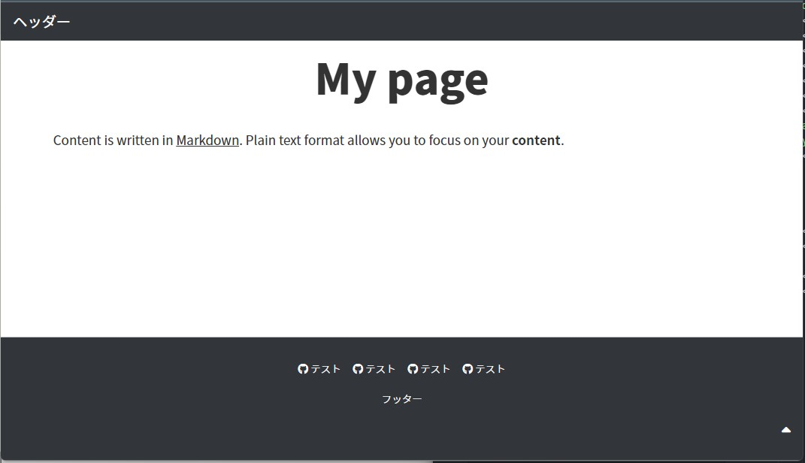

<!-- omit in toc -->
# tutorial-jekyll

Jekyll のチュートリアル用リポジトリです。

## 1. なにはともあれチュートリアル

### 1.1. 環境構築

1. 参考文献をもとに Ruby をインストール。

    ```shell
    $ sudo apt-get install ruby-full build-essential zlib1g-dev
    $ ruby -v
    $ gem -v
    ```

2. 以下を `.zshrc` へ追加。

    ```shell
    # Install Ruby Gems to ~/gems
    export GEM_HOME="$HOME/gems"
    export PATH="$HOME/gems/bin:$PATH"
    ```

3. シェルを再起動または `.zshrc` を再読み込みして環境変数のチェック。

    ```shell
    $ source ~/.zshrc
    $ env | grep gems
    ```

4. Jekyll をインストール。

    ```shell
    $ gem install jekyll bundler
    # コマンド実行後、出力が出るまでしばらく時間かかった
    $ jekyll --version
    ```

### 1.2. ビルドしてみる

```shell
# ルートディレクトリを作成
$ mkdir docs
$ cd docs

# 設定ファイルを作成
# 作成したらチュートリアルに記載のあるコードを3つのファイルへ記述する
$ touch _config.yml index.md default.html
$ mkdir _layouts && mv default.html _layouts

# serve でサイトをサーバーに構築
$ jekyll serve

# Server address: http://127.0.0.1:4000 と出ているので localhost へブラウザでアクセスする
```

うおー



`index.md` を基に html ファイル `_site/index.html` も生成された。

```shell
.
├── docs
│   ├── _layouts
│   │   └── default.html
│   ├── _site             ← 生成
│   │   └── index.html   ← 生成
│   ├── _config.yml
│   └── index.md
└── README.md
```

`index.md`

```md
---
title: My page
layout: default
---

# {{ page.title }}

Content is written in [Markdown](https://learnxinyminutes.com/docs/markdown/). Plain text format allows you to focus on your **content**.

<!--
You can use HTML elements in Markdown, such as the comment element, and they won't be affected by a markdown parser. However, if you create an HTML element in your markdown file, you cannot use markdown syntax within that element's contents.
-->
```

`_site/index.html`

```html
<!DOCTYPE html>
<html>
  <body>
     <h1 id="my-page">My page</h1>

<p>Content is written in <a href="https://learnxinyminutes.com/docs/markdown/">Markdown</a>. Plain text format allows you to focus on your <strong>content</strong>.</p>

<!--
You can use HTML elements in Markdown, such as the comment element, and they won't be affected by a markdown parser. However, if you create an HTML element in your markdown file, you cannot use markdown syntax within that element's contents.
-->

  </body>
</html>
```

## 2. GitHub Pages で公開してみる

1. GitHub のこのリポジトリへアクセス。
2. `Settings` > `Pages` > `GitHub Pages` へ遷移。
3. `Build and deployment` > `Source` が `Deploy from a branch` になっていることを確認。
4. `Build and deployment` > `Branch` を `None` から `main` へ変更。
5. 表示されたディレクトリ設定を `/docs` へ変更。
6. `Save` をクリック。
7. 画面上部に `GitHub Pages source saved.` と表示される。
8. `Actions` タブへ遷移。既にビルドが始まっている！
9. `Jobs` がすべて緑になり、ログに `Cleaning up orphan processes` と表示されていたら完了ぽい。
    1. 
10. もう一度 `Settings` > `Pages` > `GitHub Pages` へ遷移。
11. URL が発行されているのでクリック。
12. うおーーー
    1. 

## 3. デフォルトレイアウトのテンプレートを作ってみよー

チュートリアルの続き `1. デフォルトレイアウトのテンプレートを作る` から再開。

1. レイアウトのソースコードを準備する。
    1. さっき準備した ★ の `default.html` へ……

        ```shell
        .
        ├── docs
        │   ├── _layouts
        │   │   └── default.html ★
        │   ├── _site
        │   │   └── index.html
        │   ├── _config.yml
        │   └── index.md
        └── README.md
        ```

    2. 以下を書き込む。

        ```html
        <!DOCTYPE html>
        <html lang="ja">
        <head>
            <meta charset="UTF-8">
            <meta http-equiv="X-UA-Compatible" content="IE=edge">
            <meta name="viewport" content="width=device-width, initial-scale=1.0">
            <meta name="theme-color" content="#313539">
            <title>テストだよ</title>
            <link rel="stylesheet" href="./css/normalize.css">
            <link rel="stylesheet" href="./css/style.css">
        </head>
        <body id="content">
            <header id="top">
                <div class="wrapper">
                    <p id="title"><a href="./">ヘッダー</a></p>
                    <p id="catch"></p>
                </div>
            </header>
            <div class="wrapper">
            {{ content }}
            </div>
            <footer>
                <div class="wrapper">
                    <ul>
                        <li><a href="#"><i class="fa-brands fa-github"></i> テスト</a></li>
                        <li><a href="#"><i class="fa-brands fa-github"></i> テスト</a></li>
                        <li><a href="#"><i class="fa-brands fa-github"></i> テスト</a></li>
                        <li><a href="#"><i class="fa-brands fa-github"></i> テスト</a></li>
                    </ul>
                    <p id="copy">フッター</p>
                    <div id="go-top">
                        <a href="#top">
                            <p><i class="fa-solid fa-caret-up"></i></p>
                        </a>
                    </div>
                </div>
            </footer>

            <!-- 表示処理の後に読み込み -->
            <link href="https://fonts.googleapis.com/css2?family=Noto+Sans+JP:wght@300;400;700;900&display=swap" rel="stylesheet">
            <script src="https://kit.fontawesome.com/338ea6a4d5.js" crossorigin="anonymous"></script>
            <script></script>
        </body>
        </html>
        ```

    3. この際、マークダウンの表示先を示す `{{ content }}` を `<body>` タグ内に書き込んでおく。

        ```html
        <body id="content">
            ...
            <div class="wrapper">
            {{ content }} <!-- ←書き込み -->
            </div>
            ...
        </body>
        ```

2. 保存して localhost へアクセス。
3. うおーーーーー
    1. 
    2. CSS ファイルが無いためデフォルトの表示の状態になっている。
    3. `$ jekyll serve` が実行中の場合、自動で html ファイルの更新も行われるぽい。
4. CSS ファイルを配置する。

    ```shell
    .
    ├── docs
    │   ├── _layouts
    │   │   └── default.html
    │   ├── _site
    │   │   ├── css            ★ 2. ここに生成された
    │   │   │   ├── normalize.css
    │   │   │   └── style.css
    │   │   └── index.html
    │   ├── css                 ★ 1. CSS を配置すると
    │   │   ├── normalize.css
    │   │   └── style.css
    │   ├── _config.yml
    │   └── index.md
    └── README.md
    ```

    1. これまた `index.html` が存在する `_site` 配下へ自動生成される。
    2. 今回は `css` ディレクトリ配下に `normalize.css` と `style.css` を入れた状態で丸ごと配置したけど込み込みで複製してくれてるみたい。
    3. つまり `index.html` に記述した相対パス `<link rel="stylesheet" href="./css/style.css">` もしっかり再現されている。

5. localhost へアクセスする。
6. うおーーーーーーーーーーーーーーーーーーーーーーーーーーーーーーーーーーーーーーーーーーーーーー
    1. 

7. GitHub へプッシュしてみる。
8. ビルド完了後、アクセス。
9. しっかり表示された！
    1. 

## 4. 参考文献

- [インストール | Jekyll • シンプルで、ブログのような、静的サイト](http://jekyllrb-ja.github.io/docs/installation/)
- [Jekyll on Ubuntu | Jekyll • シンプルで、ブログのような、静的サイト](http://jekyllrb-ja.github.io/docs/installation/ubuntu/)
- [HTMLサイトをJekyllに変換 | Jekyll • シンプルで、ブログのような、静的サイト](http://jekyllrb-ja.github.io/tutorials/convert-existing-site-to-jekyll/)
