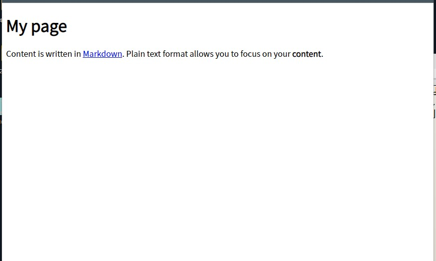

<!-- omit in toc -->
# マークダウン記法の表示テスト

マークダウン記法の表示テスト用ファイル（ページ）です。  

参考:

- [Markdown 記法一覧表 チートシート](https://growi.cloud/blog/811)
- [Markdown記法 チートシート - Qiita](https://qiita.com/Qiita/items/c686397e4a0f4f11683d)

<!-- omit in toc -->
## メモ

<!-- omit in toc -->
### i. マークダウンから HTML ファイルへの検知・生成

この HTML ファイルは `docs/notes/contents/20221118_show_markdown_test.md` から生成されています。
このマークダウンファイル内へ最初に記述された以下の設定テキストブロック（[YAML front matter ブロック](http://jekyllrb-ja.github.io/docs/front-matter/) と言う）を Jekyll が検知して処理しています。  

```md
---
title: マークダウン表示テスト
layout: default
---
```

<!-- omit in toc -->
### ii. HTML と CSS

HTML のレイアウトは `docs/_layouts/default.html` をテンプレートとして生成されています。

CSS は `docs/css/style.css` `docs/css/normalize.css` を使用しています。  
レイアウトの `<link>` タグの `href` 属性へ `{{ "/css/normalize.css" | relative_url }}` を記述して読み込まれています。

```html
<head>
    ...
    <link rel="stylesheet" href="{{ "/css/normalize.css" | relative_url }}">
    ...
    <link rel="stylesheet" href="{{ "/css/style.css" | relative_url }}">
</head>
```

<!-- omit in toc -->
### iii. その他

- マークダウン記法の原本を確認したい際は  `docs/notes/contents/20221118_show_markdown_test.md` を確認してください。
    - 一部の見出しに含んでいる `<!-- omit in toc -->` は Jekyll とは無関係です。コーディング用の記述です。
- ブラウザのデフォルト表示を確認したい際は、開発者ツールで `<head>` タグ内の CSS 読み込み用の記述を削除してください。

<!-- omit in toc -->
## 目次

- [1. 見出し 2](#1-見出し-2)
    - [1.1. 見出し 3](#11-見出し-3)
        - [1.1.1. 見出し 4](#111-見出し-4)
            - [1.1.1.1. 見出し 5](#1111-見出し-5)
                - [1.1.1.1.1. 見出し 6](#11111-見出し-6)
- [2. 改行](#2-改行)
    - [2.1. 末尾にスペースなしで改行](#21-末尾にスペースなしで改行)
    - [2.2. 末尾にスペースありで改行](#22-末尾にスペースありで改行)
- [3. 段落](#3-段落)
- [4. 装飾](#4-装飾)
- [5. リンク](#5-リンク)
- [6. 画像の埋め込み](#6-画像の埋め込み)
    - [6.1. 相対パス指定](#61-相対パス指定)
    - [6.2. 絶対パス指定](#62-絶対パス指定)
- [7. テーブル](#7-テーブル)
- [8. 水平線](#8-水平線)
- [9. 引用](#9-引用)
- [10. リスト](#10-リスト)
    - [10.1. 箇条書きリスト](#101-箇条書きリスト)
    - [10.2. 番号付きリスト](#102-番号付きリスト)
    - [10.3. チェックリスト](#103-チェックリスト)
- [11. コード](#11-コード)
    - [11.1. コードブロック](#111-コードブロック)
    - [11.2. コードスパン](#112-コードスパン)
- [12. HTML](#12-html)
- [見出し](#見出し)
    - [見出し](#見出し-1)
- [heading](#heading)
    - [heading](#heading-1)
- [Heading](#heading-2)
    - [Heading](#heading-3)

## 1. 見出し 2

テキストテキストテキストテキストテキストテキストテキストテキストテキストテキストテキストテキストテキストテキスト

### 1.1. 見出し 3

テキストが長いテキストが長いテキストが長いテキストが長いテキストが長いテキストが長いテキストが長いテキストが長いテキストが長いテキストが長いテキストが長いテキストが長いテキストが長いテキストが長いテキストが長いテキストが長いテキストが長いテキストが長いテキストが長いテキストが長いテキストが長いテキストが長いテキストが長いテキストが長いテキストが長いテキストが長いテキストが長いテキストが長いテキストが長いテキストが長いテキストが長いテキストが長い

#### 1.1.1. 見出し 4

テキストテキストテキストテキストテキストテキストテキストテキストテキストテキストテキストテキストテキストテキスト

##### 1.1.1.1. 見出し 5

テキストテキストテキストテキストテキストテキストテキストテキストテキストテキストテキストテキストテキストテキスト

###### 1.1.1.1.1. 見出し 6

テキストテキストテキストテキストテキストテキストテキストテキストテキストテキストテキストテキストテキストテキスト

## 2. 改行

### 2.1. 末尾にスペースなしで改行

テキストテキストテキストテキストテキスト
テキストテキストテキストテキストテキスト
テキストテキストテキストテキストテキスト

### 2.2. 末尾にスペースありで改行

テキストテキストテキストテキストテキスト  
テキストテキストテキストテキストテキスト  
テキストテキストテキストテキストテキスト  

## 3. 段落

空白行を挟むと段落になります。空白行を挟むと段落になります。空白行を挟むと段落になります。空白行を挟むと段落になります。空白行を挟むと段落になります。空白行を挟むと段落になります。

空白行を挟むと段落になります。空白行を挟むと段落になります。空白行を挟むと段落になります。空白行を挟むと段落になります。空白行を挟むと段落になります。空白行を挟むと段落になります。

## 4. 装飾

*イタリック（アスタリスク1個）*

_イタリック（アンダースコア2個）_

**ボールド（アスタリスク2個）**

**ボールド（アスタリスク2個）**

~~取り消し線（チルダ2個）~~

~~***組み合わせ***~~

## 5. リンク

[kenkenpa198/tutorial-jekyll](https://github.com/kenkenpa198/tutorial-jekyll)

## 6. 画像の埋め込み

### 6.1. 相対パス指定

`./../../images/20221117_preview.jpg`  


### 6.2. 絶対パス指定

`/docs/images/20221117_preview.jpg`  


`/images/20221117_preview.jpg`  


## 7. テーブル

| あいうえお | かきくけこ | さしすせそ |
|------------|------------|------------|
| ねこ       | いぬ       | ごりら     |
| ねこ       | いぬ       | ごりら     |
| ねこ       | いぬ       | ごりら     |
| ねこ       | いぬ       | ごりら     |
| ねこ       | いぬ       | ごりら     |

| 左寄せ左寄せ左寄せ     | 中央寄せ中央寄せ中央寄せ     | 右寄せ右寄せ右寄せ      |
|:-----------------------|:----------------------------:|------------------------:|
| ねこ                   | いぬ                         | ごりら                  |
| ねこ                   | いぬ                         | ごりら                  |
| ねこ                   | いぬ                         | ごりら                  |
| ねこ                   | いぬ                         | ごりら                  |
| ねこ                   | いぬ                         | ごりら                  |

| あいうえお | かきくけこ | さしすせそ                             |
|------------|------------|----------------------------------------|
| ねこ       | いぬ       | セル内改行<br>セル内改行<br>セル内改行 |
| ねこ       | いぬ       | ごりら                                 |

間にテキスト

| あいうえお | かきくけこ | さしすせそ | コンテンツが長いコンテンツが長いコンテンツが長いコンテンツが長いコンテンツが長いコンテンツが長いコンテンツが長い |
|------------|------------|------------|------------------------------------------------------------------------------------------------------------------|
| ねこ       | いぬ       | ごりら     | コンテンツが長いコンテンツが長いコンテンツが長いコンテンツが長いコンテンツが長いコンテンツが長いコンテンツが長い |
| ねこ       | いぬ       | ごりら     | コンテンツが長いコンテンツが長いコンテンツが長いコンテンツが長いコンテンツが長いコンテンツが長いコンテンツが長い |
| ねこ       | いぬ       | ごりら     | コンテンツが長いコンテンツが長いコンテンツが長いコンテンツが長いコンテンツが長いコンテンツが長いコンテンツが長い |
| ねこ       | いぬ       | ごりら     | コンテンツが長いコンテンツが長いコンテンツが長いコンテンツが長いコンテンツが長いコンテンツが長いコンテンツが長い |
| ねこ       | いぬ       | ごりら     | コンテンツが長いコンテンツが長いコンテンツが長いコンテンツが長いコンテンツが長いコンテンツが長いコンテンツが長い |

## 8. 水平線

ハイフン3つ

---

アンダースコア3つ

___

アスタリスク3つ

***

## 9. 引用

> テキスト

-

> テキストテキストテキストテキストテキストテキストテキストテキストテキストテキストテキストテキストテキストテキストテキストテキストテキストテキストテキストテキストテキストテキスト
> テキストテキストテキストテキストテキストテキストテキストテキストテキストテキストテキストテキストテキストテキストテキストテキストテキストテキストテキストテキストテキストテキスト
> テキストテキストテキストテキストテキストテキストテキストテキストテキストテキストテキストテキストテキストテキストテキストテキストテキストテキストテキストテキストテキストテキスト

-

> テキストテキストテキストテキストテキストテキストテキストテキストテキストテキストテキストテキストテキストテキストテキストテキストテキストテキストテキストテキストテキストテキスト
>
> テキストテキストテキストテキストテキストテキストテキストテキストテキストテキストテキストテキストテキストテキストテキストテキストテキストテキストテキストテキストテキストテキスト

-

> 引用引用引用引用引用
>> 二重引用二重引用二重引用二重引用二重引用
>> 二重引用二重引用二重引用二重引用二重引用
>> 二重引用二重引用二重引用二重引用二重引用
> 引用引用引用引用引用

## 10. リスト

### 10.1. 箇条書きリスト

- 箇条書きリスト
- 箇条書きリスト
    - 箇条書きリスト
    - 箇条書きリスト
        - 箇条書きリスト
        - 箇条書きリスト
    - 箇条書きリスト
- 箇条書きリスト

- コンテンツが長いコンテンツが長いコンテンツが長いコンテンツが長いコンテンツが長いコンテンツが長いコンテンツが長いコンテンツが長いコンテンツが長いコンテンツが長いコンテンツが長いコンテンツが長いコンテンツが長いコンテンツが長いコンテンツが長い
- コンテンツが長いコンテンツが長いコンテンツが長いコンテンツが長いコンテンツが長いコンテンツが長いコンテンツが長いコンテンツが長いコンテンツが長いコンテンツが長いコンテンツが長いコンテンツが長いコンテンツが長いコンテンツが長いコンテンツが長い
    - コンテンツが長いコンテンツが長いコンテンツが長いコンテンツが長いコンテンツが長いコンテンツが長いコンテンツが長いコンテンツが長いコンテンツが長いコンテンツが長いコンテンツが長いコンテンツが長いコンテンツが長いコンテンツが長いコンテンツが長い
        - コンテンツが長いコンテンツが長いコンテンツが長いコンテンツが長いコンテンツが長いコンテンツが長いコンテンツが長いコンテンツが長いコンテンツが長いコンテンツが長いコンテンツが長いコンテンツが長いコンテンツが長いコンテンツが長いコンテンツが長い

### 10.2. 番号付きリスト

1. 番号付きリスト
2. 番号付きリスト
    1. 番号付きリスト
    2. 番号付きリスト
        1. 番号付きリスト
        2. 
    3. 番号付きリスト
3. 番号付きリスト

### 10.3. チェックリスト

- [ ] チェックリスト
- [ ] チェックリスト
    - [ ] チェックリスト
    - [ ] チェックリスト
        - [ ] チェックリスト
        - [ ] チェックリスト
    - [x] チェックリスト
- [x] チェックリスト

## 11. コード

### 11.1. コードブロック

通常

```
#include <stdio.h>

int main(void) {
    printf("Hello, World!\n");
}
```

シンタックスハイライト

```c
#include <stdio.h>

int main(void) {
    printf("Hello, World!\n");
}
```

### 11.2. コードスパン

文章の中に `printf("Hello, World!\n");` を埋め込みます。  
文章の中に `printf("Hello, World!\n");` を埋め込みます。  
文章の中に `printf("Hello, World!\n");` を埋め込みます。

## 12. HTML

<details><summary><b>読み上げを開始する</b></summary><div>

---

1. 参加させたいボイスチャンネルへ入室してください。
2. 読み上げさせたいテキストチャンネルで以下のコマンドのいずれかを入力して送信してください。

    ```text
    !mdn start
    ```

    ```text
    !mdn s
    ```

3. もだねちゃんがボイスチャンネルへ入室します。以降に読み上げ対象チャンネルへ投稿されたメッセージを読み上げてくれます🎤

---

</div></details>

---

以上。  
以下個人的な確認用。

## 見出し

### 見出し

## heading

### heading

## Heading

### Heading